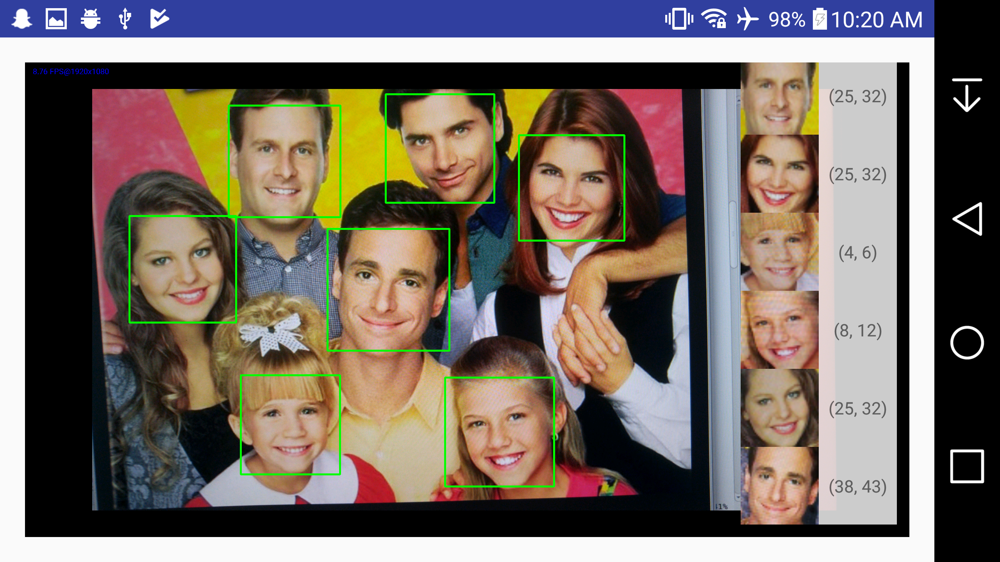
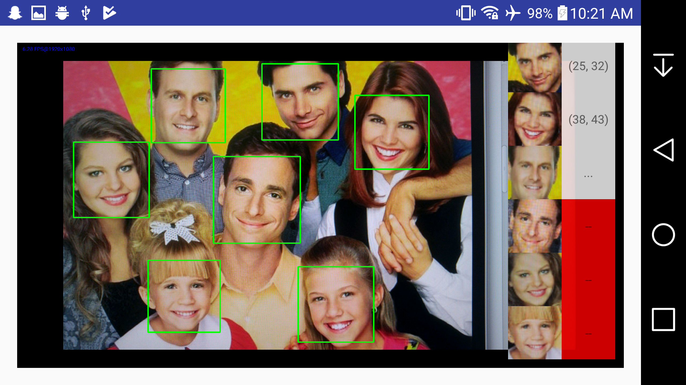

# Age Estimation App for Android #
 This fun android app can estimate the ages of people using face detection and tensorflow. 
 
 ## Introduction ## 
This app uses multi face detection accomplished by using a pre-trianed LBP cascade classifier and OpenCV. The detected faces are extracted using the bounding box and feed into a pre-trained Inceptionv3 model. The Inception model's output is interpreted to get the best guessed age range for each face and the results are displayed on screen.  
  
The pre-trained classifier and Inception models are included in this repository.
  
The application was created for a class assignment, as such please excuse the poor coding choices due to the hastyness under which this app was developed. With this app, I was able to learn some basics regarding android development using OpenCV and Tensorflow.



## Building the app ##
Import the application from the [AndroidOpenCVVideoProcessing](AndroidOpenCVVideoProcessing) dir into Android Studio as a gradle application.  
  
[build.gradle](AndroidOpenCVVideoProcessing/app/build.gradle) will need to be modified for configuring Bazel binary location, target archtecture, and Tensorflow source dir.  
  
Tensorflow source:   
[https://github.com/tensorflow/tensorflow](https://github.com/tensorflow/tensorflow)
  
It requires a device with a Camera and Android OS version >= 5.0 (API 23). Everything should be included, aside from build dependencies provided by Android Studio. This project was built on Ubuntu 16.04 only. See [Requirements](#requirements) for a more complete set of dependancies.  

## How to Use ##
Simply start the app, point the camera at the faces you wish to guess ages with. Once boxes appear around detected faces, tap the screen once and the faces will be processed. The results will display on the screen. I limited the app to guess only 6 faces at a time, due to the GUI design choice.  
  
It may take a few seconds to process each face, so the GUI will indicate progress as follows:
  * __Processesed__: White box with `(x,y)` age range
  * __Processing__:  White box with `...`
  * __Unprocessed__: Red box with `--`
  


## Face Detection ##
I decided to use an LBP face classifier, to keep the framerate high for video. The user and subjects can adjust accordingly, in real-time, to improve detection. I used a openCV build-in cascade classifier and instantiated it with a pre-trained LPB xml file, [lbpcascade_frontalface.xml](AndroidOpenCVVideoProcessing/app/src/main/res/raw/lbpcascade_frontalface.xml).  
  
I sourced [lbpcascade_frontalface.xml](AndroidOpenCVVideoProcessing/app/src/main/res/raw/lbpcascade_frontalface.xml) from the OpenCV github repository. The file is found:  
[https://github.com/opencv/opencv/blob/master/data/lbpcascades](https://github.com/opencv/opencv/blob/master/data/lbpcascades).
  
__License__ included for using lbpcascade_frontalface.xml
  * [OpenCV_LICENSE](OpenCV_LICENSE)

## Age Estimation ##
The Inception model included was pre-trained from the [Adience Benchmark](http://www.openu.ac.il/home/hassner/Adience/data.html).  
  
You can find instructions on how to train the model yourself or download pre-trained checkpoints from:   (https://github.com/dpressel/rude-carnie)[https://github.com/dpressel/rude-carnie].
  
Android requires a frozen model (protobuff) with proper input and output names. In order to freeze the model in a way that Android's tensorflow API can use it, we have to load the checkpoints for testing and output a new model.pbtext for freezing. Files for getting you started can be found [here](docs)
  
  * [chkpoint-to-pbtext.py](docs/chkpoint-to-pbtext.py): Outputs an Android compatible pbtxt from InceptionV3 Checkpoint files
    * __Usage__
    ```
    python chkpoint-to-pbtext.py --model_dir </path/to/checkpoints> --output_model_dir </path/to/output.pbtxt> --output_model_name <model.pbtxt>
    ```
  * [prep-tf-android.py](docs/prep-tf-android.py): Converts checkpoints into Android compatible protobuff model
    * __Modify__ file to point to input files
    * __Usage__
    ```
    python prep-tf-android.py
    ```
  
This model can is limited to classifing the following age ranges
  - (0, 2)
  - (4, 6)
  - (8, 12)
  - (15, 20)
  - (25, 32)
  - (38, 43)
  - (48, 53)
  - (60, 100)

The included model (frozen_age_graph.pb)[AndroidOpenCVVideoProcessing/app/src/main/assets] may be subject to the following __Lincenses__ 
  * [AdienceBenchmark_LICENSE](AdienceBenchmark_LICENSE)
  * [AgeGenderDeepLearning_LICENSE](AgeGenderDeepLearning_LICENSE)

## Requirements ##
  * __Software__
    * Ubuntu (built on v16.04)
    * Android Studio
    * Bazel
    * cmake
    * Tensorflow
    * OpenCV for android (Included v3.0.0)
    * Python 3.5.x
  * __Hardware__ (Andriod Pone)
    * Device with Android OS >= v5.0 (API 23, Marshmallow)
    * Camera


## License ##

Before using this software, please check the [LICENSE](LICENSE) file for details. 

Additionally, this project is using open sourced code and resources from other projects as stated above. Please check their licenses accordinly.
  * [OpenCV_LICENSE](OpenCV_LICENSE)
  * [AdienceBenchmark_LICENSE](AdienceBenchmark_LICENSE)
  * [AgeGenderDeepLearning_LICENSE](AgeGenderDeepLearning_LICENSE)

## Contact ##
Jacob Morton (jacob [at] postech [dot] ac [dot] kr)
